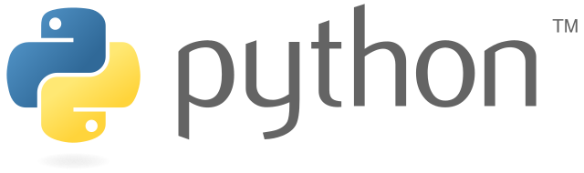

# course-python
Podstawy programowania w języku Python

### Informacje o przedmiocie

Bioinformatyka, I rok

#### Plan zajęć

| Lab | Data | Opis | Zadania | Notatki |
| :---: | --- | --- | --- | :---: |
| **01** | 08.10.2025 | [Wprowadzenie do języka Python](./intro.pdf), instalacja, wykonywanie programów | [lab01](./labs/lab01.md) | [notes01](./notes/01.ipynb) |
| **02** | 15.10.2025 | [Liczby](https://youtu.be/khKv-8q7YmY), wyrażenia i operatory logiczne | [lab02](./labs/lab02.md) | [notes02](./notes/02.ipynb) |
| **03** | 22.10.2025 | [Łańcuchy znaków](https://youtu.be/k9TUPpGqYTo) | [lab03](./labs/lab03.md) | [notes03](./notes/03.ipynb) |
| **04** | 29.10.2025 | Pętla while, pętla for | - | - |
| **05** | 05.11.2025 | Listy, krotki | - | - |
| **06** | 12.11.2025 | Pętla for | - | - |
| **07** | 19.11.2025 | Słowniki | - | - |
| **08** | 26.11.2025 | Pliki | - | - |
| **09** | 03.12.2025 | Zbiory | - | - |
| **10** | 10.12.2025 | Funkcje | - | - |
| **11** | 17.12.2025 | Generatory i listy składane | - | - |
| **12** | 07.01.2026 | Moduły i zasięgi nazw | - | - |
| **13** | 14.01.2026 | Klasy | - | - |
| **14** | 21.01.2026 | Biblioteka standardowa | - | - |
| **15** | 28.01.2026 | Zaliczenie przedmiotu | - | - |

#### Sprawozdania

Sprawozdania należy przesyłać na zadania na platformie MsTeams.

#### Kryteria zaliczenia

Na ocenę końcową przedmiotu składają się oceny z:
* testu zaliczeniowego (waga: 70%)
* składanych sprawozdań (waga: 20%)
* aktywność i obecność na zajęciach (waga: 10%)

### Materiały dodatkowe

#### :clapper: YouTube:

* [Python Programming Beginner Tutorials](https://youtu.be/_uQrJ0TkZlc) by *Corey Schafer*
* [The complete guide to Python](https://youtu.be/mDKM-JtUhhc) by 
*Clear Code*

#### :closed_book: Książki:

* Lutz M. Python. Wprowadzenie. Wydanie V. Wydawnictwo Helion. 2020. [[księgarnia](https://helion.pl/ksiazki/python-wprowadzenie-wydanie-v-mark-lutz,pytho5.htm#format/d)]

#### :thumbsup: Dobre praktyki

* Jak pisać czytelny kod w Pythonie: [PEP 8 - Style Guide for Python Code](https://www.python.org/dev/peps/pep-0008/).
* Filozofia Pythona w 20 wersach: [PEP 20 - The Zen of Python](https://www.python.org/dev/peps/pep-0020/).

### Kontakt

prof. UAM dr hab. Andrzej Zieleziński (andrzej.zielezinski@amu.edu.pl)

[Pracownia Biologii Obliczeniowej](http://www.combio.pl) (pokój 1.97)

Wydział Biologii UAM