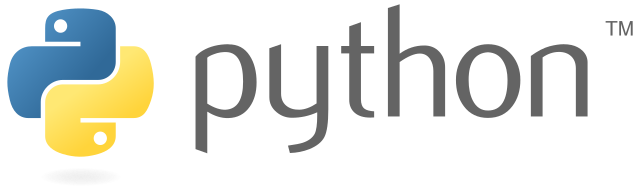

## Podstawy programowania w języku Python

### Informacje o przedmiocie

Bioinformatyka, I rok

#### Plan zajęć

| Lab | Data | Opis | Zadania | Notatki |
| :---: | --- | --- | --- | :---: |
| **01** | 20.11.2024 | [Wprowadzenie do języka Python](./intro.pdf), instalacja, wykonywanie programów, pojęcie zmiennej, [liczby](https://youtu.be/khKv-8q7YmY) | [lab01](./labs/lab01.md) | [n01](./notes/n01.ipynb) |
| **02** | 27.11.2024 | [Łańcuchy znaków](https://youtu.be/k9TUPpGqYTo), [instrukcje warunkowe, operatory logiczne](https://youtu.be/DZwmZ8Usvnk), [pętla while](https://youtu.be/6iF8Xb7Z3wQ?t=379) | [lab02](./labs/lab02.md)  | [n02](./notes/n02.ipynb) |
| **03**    | 04.12.2024 | [Listy, krotki](https://youtu.be/W8KRzm-HUcc), [pętla for](https://youtu.be/6iF8Xb7Z3wQ) | [lab03](labs/lab03.md) | [n03](./notes/n03.ipynb) |
| **04**    | 11.12.2024 | Zbiory i słowniki  | - | - |
| **05**    | 18.12.2024 | Pliki i obsługa wyjątków | - | - |
| **06**    | 08.01.2025 | Funkcje i zasięg nazw | - | - |
| **07**    | 15.01.2025 | Generatory i listy składane | - | - |
| **08**    | 22.01.2025 | Moduły i biblioteka standardowa | - | - |
| **09**    | 29.01.2025 | Zaliczenie przedmiotu  | - | - |

#### Sprawozdania

Sprawozdania należy przesyłać na zadania na platformie MsTeams.

#### Kryteria zaliczenia

Na ocenę końcową przedmiotu składają się oceny z:
* testu zaliczeniowego (waga: 60%)
* składanych sprawozdań (waga: 30%)
* aktywność i obecność na zajęciach (waga: 10%)

### Materiały dodatkowe

#### :clapper: YouTube:

* [Python Programming Beginner Tutorials](https://youtu.be/_uQrJ0TkZlc) by *Corey Schafer*
* [The complete guide to Python](https://youtu.be/mDKM-JtUhhc) by 
*Clear Code*

#### :closed_book: Książki:

* Lutz M. Python. Wprowadzenie. Wydanie V. Wydawnictwo Helion. 2020. [[księgarnia](https://helion.pl/ksiazki/python-wprowadzenie-wydanie-v-mark-lutz,pytho5.htm#format/d)]

#### :thumbsup: Dobre praktyki

* Jak pisać czytelny kod w Pythonie: [PEP 8 - Style Guide for Python Code](https://www.python.org/dev/peps/pep-0008/).
* Filozofia Pythona w 20 wersach: [PEP 20 - The Zen of Python](https://www.python.org/dev/peps/pep-0020/).

### Kontakt

dr hab. Andrzej Zieleziński (andrzej.zielezinski@amu.edu.pl)

[Zakład Biologii Obliczeniowej](http://www.combio.pl) (pokój 1.97)

Wydział Biologii UAM