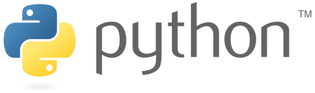

# course-python
Podstawy programowania w języku Python (I rok Bioinformatyki)

### Informacje o przedmiocie

Bioinformatyka, I rok

#### Plan zajęć

| Lab | Data | Opis | Zadania | Notatki |
| :---: | --- | --- | --- | :---: |
| **01** | 06.10.2026 | [Wprowadzenie do języka Python](./intro.pdf), pierwszy program | [lab01](./labs/lab01.md) | n01 |
| **02** | 13.10.2026 | Liczby, operatory, instrukcja if | - | - |
| **03** | 20.10.2026 | Łańcuchy znaków | - | - |
| **04** | 27.10.2026 | Pętla for, pętla while | - | - |
| **05** | 03.11.2026 | Listy, krotki | - | - |
| **06** | 10.11.2026 | Słowniki | - | - |
| **07** | 17.11.2026 | Pliki | - | - |
| **08** | 24.11.2026 | Zbiory, obsługa wyjątków | - | - |
| **09** | 01.12.2026 | Funkcje | - | - |
| **10** | 08.12.2026 | Zasięgi nazw, listy składane | - | -|
| **11** | 15.12.2026 | Generatory | - | - |
| **12** | 22.12.2026 | Moduły | - | - |
| **13** | 12.01.2027 | Programowanie obiektowe | - | - |
| **14** | 19.01.2027 | Biblioteka standardowa | - | - |
| **15** | 01.02.2027 | Zaliczenie przedmiotu | - | - |

#### Sprawozdania

Sprawozdania należy przesyłać za pośrednictwem zadań na platformie Microsoft Teams.

#### Kryteria zaliczenia

Na ocenę końcową przedmiotu składają się oceny z:
* testu zaliczeniowego (waga: 70%)
* składanych sprawozdań (waga: 20%)
* aktywność i obecność na zajęciach (waga: 10%)

#### Nieobecności

Dopuszczalna jest jedna nieusprawiedliwiona nieobecność.

### Materiały dodatkowe

#### :clapper: YouTube:

* [Python Programming Beginner Tutorials](https://youtu.be/_uQrJ0TkZlc) by *Corey Schafer*
* [The complete guide to Python](https://youtu.be/mDKM-JtUhhc) by 
*Clear Code*

#### :closed_book: Książki:

* Lutz M. Python. Wprowadzenie. Wydanie V. Wydawnictwo Helion. 2020. [[księgarnia](https://helion.pl/ksiazki/python-wprowadzenie-wydanie-v-mark-lutz,pytho5.htm#format/d)]

#### :thumbsup: Dobre praktyki

* Jak pisać czytelny kod w Pythonie: [PEP 8 - Style Guide for Python Code](https://www.python.org/dev/peps/pep-0008/).
* Filozofia Pythona w 20 wersach: [PEP 20 - The Zen of Python](https://www.python.org/dev/peps/pep-0020/).

### Kontakt

prof. UAM dr hab. Andrzej Zieleziński (andrzej.zielezinski@amu.edu.pl)

[Pracownia Biologii Obliczeniowej](http://www.combio.pl) (pokój 1.97)

Wydział Biologii UAM