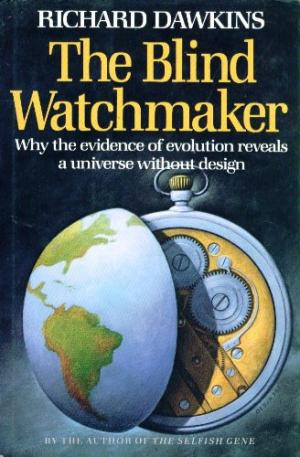

## Zad. 1
Użyj listy składanej, aby z poniższej listy utworzyć listę liczb parzystych większych od 10.

```python
input_list = [4, 50, 51, 10, 21, 5, 11, 12, 16]
```

Output:

```python
output_list = [50, 12, 16]
```

## Zad. 2
Użyj listy składanej, aby zamienić string:

```python
string = 'ATGNA'
```

w poniższą listę:

```python
lst = ['AA', 'TT', 'GG', 'AA']  # Pomiń jeżeli N
```

## Zad. 3
Zmodyfikuj poniższą funkcję stosując składnię listy składanej.

```python
def complement(dna):
    """Return a complementary DNA sequence"""
    d = {'A': 'T', 'C': 'G', 'G': 'C', 'T': 'A'}
    cdna = []
    for nt in dna.upper():
        cdna.append(d.get(nt, 'N'))
    return "".join(cdna)
```


## Zad. 4
Napisz kod, który zapisze poniższe dane do pliku tekstowego w dwóch kolumnach.

```python
names = ['OR4F5', 'OR4F29', 'OR4F16', 'SAMD11', 'NOC2L', 'NOT3']
values = [918, 939, 940, 20654, 15106, 700]
```

Output:

```
OR4F5   918
OR4F29  939
OR4F16  940
SAMD11  20654
NOC2L   15106
NOT3    700
```


## Zad. 5
Zmodyfikuj kod z poprzedniego zadania, aby geny ułożone były w pliku według malejących wartości `values`.

Output:

```
SAMD11  20654
NOC2L   15106
OR4F16  940
OR4F29  939
OR4F5   918
NOT3    700
```

## Zad. 6
Poniżej znajdują się dwa pliki wejściowe dotyczące sekwencji DNA bakterii *Mycoplasma hominis*:

1. [Mycoplasma_hominis.fasta](../data/Mycoplasma_hominis.fasta) zawiera 15 sekwencji genomowych tej bakterii.
```
>contig011
ACAGCCAGCGTTCATCCTGAGCCAGGATCAAACTCTTATAAAAAAATTTGAATTGGTTGA
TTATAAATAAAAAAATAAATTGACGTTAATGGTATTCGTATCCAGTTTTCAAAGAACTAT
CTCGTTGTTTCAAAACAACCTTTAAATATTATATACACTTTTTTTTATTTTTTCAAAAAA
...
>contig008
CAAGAAGTCAAATTGAAGCATTCATTAATGCAAATAAAACTAATCAAAATTATGCAGATT
TGATTGCAAAATTAACTAATGCTAAAAAAGCAAAGGAATCAGTTTCTGAATCTTCAAATA
AATCAGACATTATTGCAGCAAATCAAGCCTTACAACAAGCATTAAATACTGCGAAGGCTA
...
```
2. [Mycoplasma_hominis.csv](../data/Mycoplasma_hominis.csv) zawiera w osobnych wierszach lokalizację wszystkich znanych fragmentów genomowych tej bakterii (np.: genów, transkryptów itd.) w odniesieniu do sekwencji genomowej powyżej.
```
#contig,feature,start,end,strand,gene_id,biotype
contig011,gene,1,105,-,JX73_01575,rRNA
contig011,transcript,1,105,-,JX73_01575,rRNA
contig011,exon,1,105,-,JX73_01575,rRNA
contig011,gene,5831,5905,+,JX73_01605,tRNA
contig011,transcript,5831,5905,+,JX73_01605,tRNA
contig011,exon,5831,5905,+,JX73_01605,tRNA
...
```

Na przykład gen `JX73_01575` znajduje się w sekwencji `contig011` na nici `-` w lokalizacji `1` - `105` i koduje `rRNA`. Z kolei gen `JX73_01605` znajdujący się w sekwencji `contig011` umiejscowiony jest na nici `+` w pozycji `5831` - `5905`.


Zaprojektuj i utwórz program `mycoplasma.py`, który na podstawie informacji zawartych w pliku *csv* wydobędzie sekwencje **genów** i zapisze je do pliku `genes.fasta` w poniższym formacie:

Output:

```
>contig011|gene|JX73_01575|1:105|-
ACAGCCAGCGTTCATCCTGAGCCAGGATCAAACTCTTATAAAAAAATTTGAATTGGTTGATTATAAATAAAAAAATAAATTGACGTTAATGGTATTCGTATCCAG
>contig011|gene|JX73_01605|5831:5905|+
GGTCGCATAGCTCAGTGGAAGAGCACGAGCCTCCTAAGCCCGGGGTCGCAGGTTCAACTCCTGTTGCGATCGCCA
>...
```


## Zad. 7
Zmodyfikuj program, aby sekwencje genów nici `-` zostały zapisane do pliku w kierunku 5'-3' (tj. odwrotnie komplementarnym). 

> Wskazówka: Wykorzystaj funckję `reverse_complement` z poprzednich zajęć. 

Output:

```
>contig011|gene|JX73_01575|1:105|-
CTGGATACGAATACCATTAACGTCAATTTATTTTTTTATTTATAATCAACCAATTCAAATTTTTTTATAAGAGTTTGATCCTGGCTCAGGATGAACGCTGGCTGT
>contig011|gene|JX73_01605|5831:5905|+
GGTCGCATAGCTCAGTGGAAGAGCACGAGCCTCCTAAGCCCGGGGTCGCAGGTTCAACTCCTGTTGCGATCGCCA
>...
```


## Zad. 8
Zmodyfikuj program, aby sekwencja w pliku wynikowym była zawinięta do 60 znaków.

> Wskazówka: Utwórz funkcję `wrap`, która przyjmuje jako argument string i liczbę znaków do zawinięcia tekstu.

Output:

```
>contig011|gene|JX73_01575|1:105|-
CTGGATACGAATACCATTAACGTCAATTTATTTTTTTATTTATAATCAACCAATTCAAAT
TTTTTTATAAGAGTTTGATCCTGGCTCAGGATGAACGCTGGCTGT
>contig011|gene|JX73_01605|5831:5905|+
GGTCGCATAGCTCAGTGGAAGAGCACGAGCCTCCTAAGCCCGGGGTCGCAGGTTCAACTC
CTGTTGCGATCGCCA
>...
```


## Zad. 9 (dla chętnych)
 W książce "Ślepy zegarmistrz" Richard Dawkins zaprezentował symulację komputerową, która przedstawia działanie doboru naturalnego w zakresie tworzenia złożonych form biologicznych poprzez losowe mutacje. Symulacja zaczyna się od przypadkowej sekwencji liter i stopniowo przekształca się w sentencję z sztuki *Hamlet* **METHINKS IT IS LIKE A WEASEL** (*Zdaje mi się, że jest podobniejsza do łasicy*).

Napisz program `weasel.py`, który przeprowadzi procedurę Dawkinsa:

1. Wygeneruj losową sekwencję długości 28 znaków (alfabet: 26 liter i spacja).
2. Utwórz 100 kopii tej sekwencji (*reprodukcja*).
3. W każdej kopii sekwencji w jednym losowym miejscu zastąp znak innym przypadkowym znakiem z alfabetu (*mutacja*).
4. Określ, która z 100 kopii sekwencji jest najbardziej zbliżona do docelowej sekwencji METHINKS IT IS LIKE A WEASEL. W tym celu możesz obliczyć dystans Hamminga (liczbę pozycji w sekwencji niezgodnych z sekwencją docelową).
5. Zakończ program jeżeli któraś z 100 kopii sekwencji jest identyczna do hamletowskiej sentencji. W przeciwnym przypadku, wybierz jedną sekwencję, która wykazuje największe podobieństwo i przejdź do kroku 2.

Przykładowy output:

```
TATTIYAKXWTXTFTDXQHOFOYLPTLN  1
TATTIYAK WTXTFTDXQHOFOYLPTLN  2
TATTIYAK WTXTFTDXQHOF YLPTLN  3
TATTIYAK WTXTFTDXQEOF YLPTLN  4
TATTIYAK WTXTFTDXQE F YLPTLN  5
MATTIYAK WTXTFTDXQE F YLPTLN  6
...
METHINKS IT IS LIKE A WEASEL  N
```

Odpowiedz na pytania:

1. Ile pokoleń potrzebnych jest do wygenerowania docelowej sekwencji?
2. Czy symulacja Dawkinsa trafnie odwzorowuje działanie ewolucji? (dla chętnych)